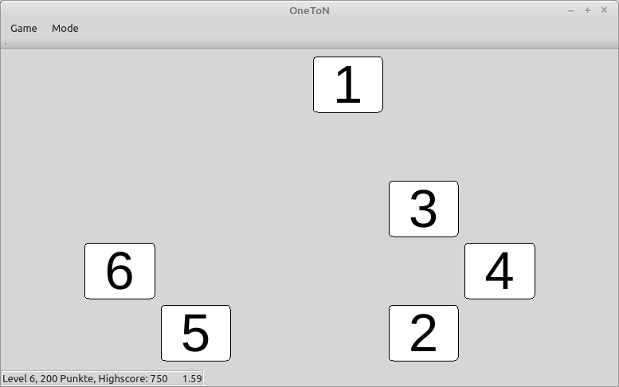
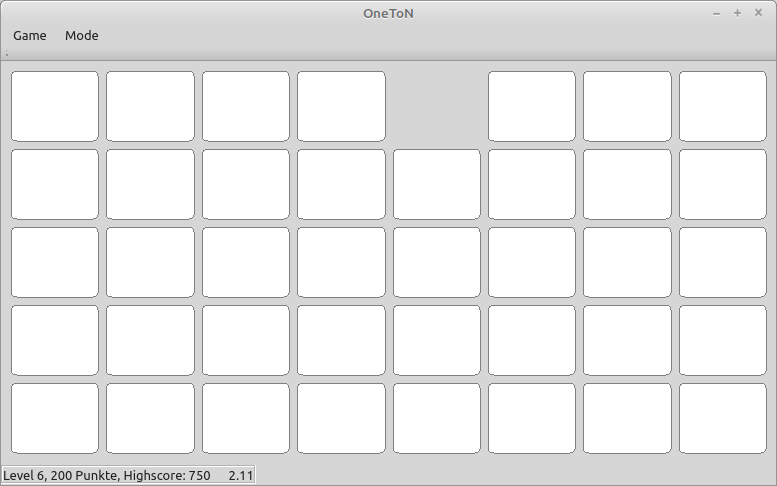
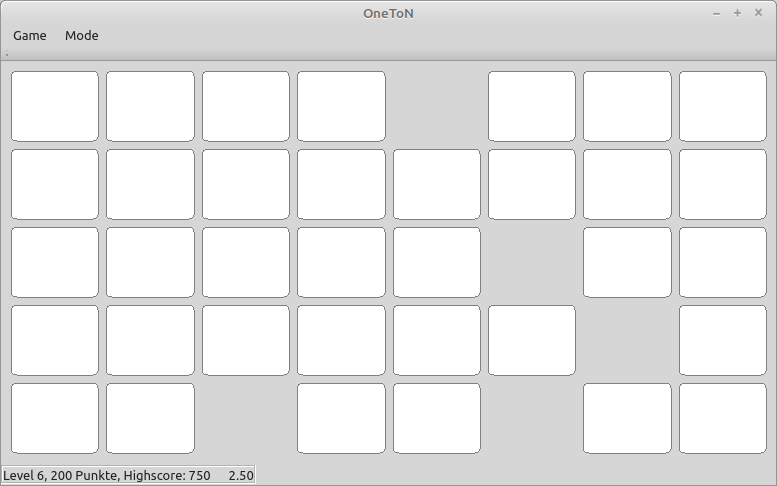
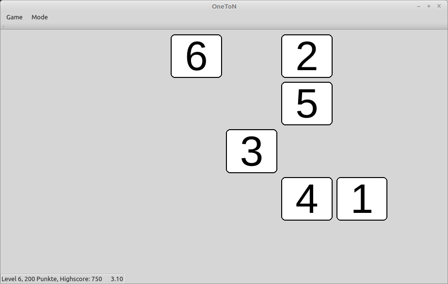
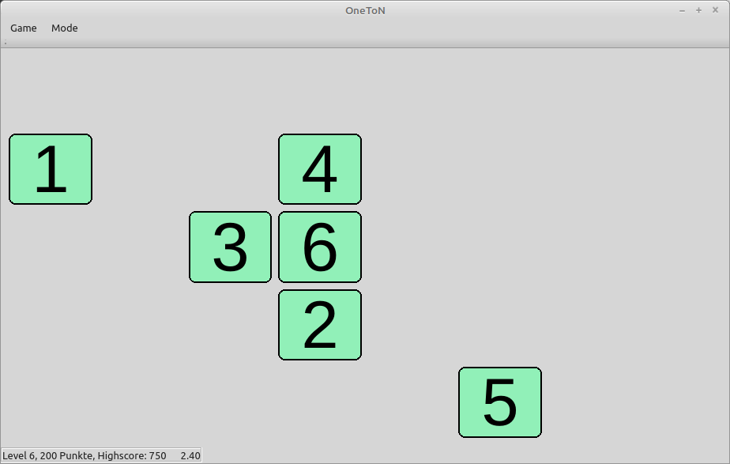
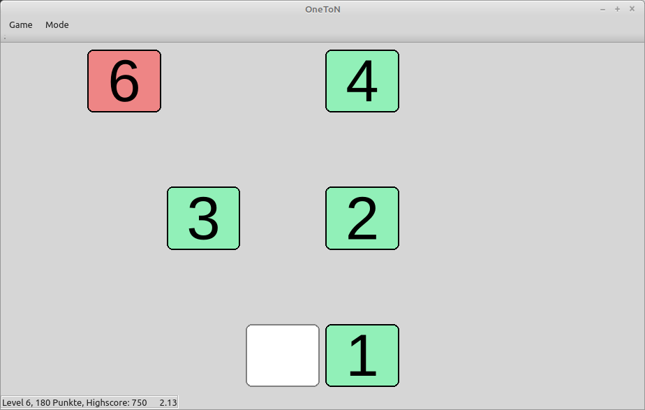

One To N
========

A very simple, but addictive game in remembering number positions. 

Please have a look at the very awesome original gameplay with Chimpanzee Ayumu: https://www.youtube.com/watch?v=GgtzZnagJiM
Here is a full documentary from Vsauce: https://www.youtube.com/watch?v=ktkjUjcZid0

Written with Qt 5.12, tested on Linux Mint 20.0

# Gameplay
## General
* If you get all right for 3 rounds in a row, you enter the next level, with one extra tile.
* If you failed 3 times in a level, you drop to the previous level.

## Intro Mode
* numbers are shown
* take your time to remember their positions (order doesn't matter)

* click on any number
* boxes show up all over the screen obscuring the numbers

* you have to find all numbers without mistakes



## Training Mode
* numbers are shown
* remember them, take your time

* click on number `1`
* now the other numbers get hidden
* click on the tiles in the correct order



## Challange Mode
Like Training Mode, but tiles with are shown only for a very short time (increasing with O(n²) ).


# TODO
## Ayumu Challange Mode - Pro
* like Ayumu Challange Mode,
* but with fixed 9 numbers and 0.5 seconds

## Chimpanzee Colors
* implement color themes
* add black/white themes

## Reward Dispenser
Build a machine with USB connection, which dispenses small amounts of some tasty food.

## Mode specific high score
Currently all modes are treated the same regarding score counting.


# Compile Instructions
```
git clone https://github.com/KarlZeilhofer/OneToN
mkdir build
cd build
qmake ../OneToN
make
```


# License
Public Domain

## Sounds
* success.wav: This sound is licensed under the Attribution Noncommercial License.  
  https://freesound.org/people/Mrthenoronha/sounds/519630/  
* fail.wav: This work is licensed under the Creative Commons 0 License.  
  https://freesound.org/people/OwlStorm/sounds/404743/  
* click.wav: This work is licensed under the Creative Commons 0 License.  
  https://freesound.org/people/waveplay./sounds/399934/


