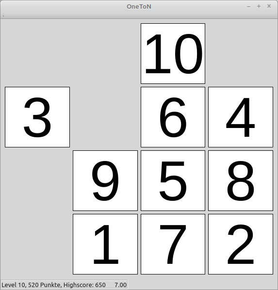
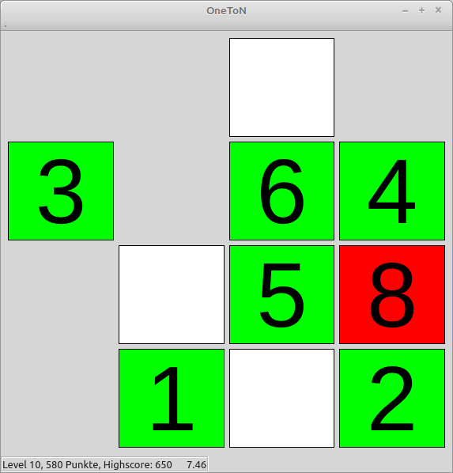

One To N
========

A very simple, but addictive game in remembering number positions. 

Please have a look at the very awesome original gameplay with Chimpanzee Ayumu: https://www.youtube.com/watch?v=GgtzZnagJiM
Here is a full documentary from Vsauce: https://www.youtube.com/watch?v=ktkjUjcZid0

Written with Qt 5.12, tested on Linux Mint 20.0

# Gameplay
## Ayumu Challange Mode
Tiles with numbers are shown for a very short time.


Try to remember theire positions. When the numbers are hidden, click
on the white tiles starting from 1, counting upwards.

If you get all right, you enter the next level, with one extra tile.

If you failed 3 times in a row, you drop to the previous level.


# TODO
## Positions Only Mode
* show numbers
* take your time
* click on any number
* boxes show up all over the screen obscuring the numbers
* you have to find all numbers without mistakes
* order doesn't matter
* amount of numbers is increased according to your performance

## Ayumu Learning Mode
* show numbers until number `1` is clicked
* hide the numbers behind boxes
* click on the boxes in the correct order
* boxes disapear on a click without showing the number

## Ayumu Challange Mode - Pro
* like Ayumu Challange Mode,
* but with fixed 9 numbers and 0.5 seconds

## Sound
* nice sound on success
* error noise on fail

## Chimpanzee Colors
* implement color themes
* add black/white themes

## Reward Dispenser
Build a machine with USB connection, which dispenses small amounts of some tasty food.


# Compile Instructions
```
git clone https://github.com/KarlZeilhofer/OneToN
mkdir build
cd build
qmake ../OneToN
make
```


# License
Public Domain
